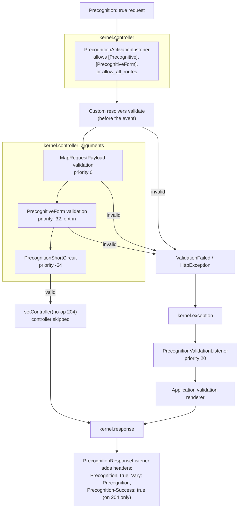

# How precognition works

Validation runs during argument resolution, before the controller body. On
failure it throws — custom resolvers throw from argument resolution;
`RequestPayloadValueResolver` (`#[MapRequestPayload]`) throws from its
`kernel.controller_arguments` subscriber — and the exception flows to
`kernel.exception`, producing the application's normal error response. On
success the short-circuit listener replaces the controller with a no-op `204`.



## Validation failures

The listener keys off Symfony's standard `ValidationFailedException`. Custom
resolvers may throw it directly; `#[MapRequestPayload]`, `#[MapQueryString]`,
and `#[MapUploadedFile]` wrap it in an `HttpException`.

The wrapped exception's original status remains unchanged. Consequently,
`#[MapRequestPayload]` failures normally remain `422`, while Symfony's default
`#[MapQueryString]` failures remain `404`. The application's normal validation
renderer produces the response body.

[`Precognition-Validate-Only`](validate-only.md) filtering happens at the
exception stage because Symfony's validator provides no validation-time event.
The listener filters the standard `ConstraintViolationListInterface` in place,
so the downstream renderer sees the filtered list.

## Activation and short-circuiting

Only opted-in precognitive requests short-circuit. Sending `Precognition: true`
to a route without `#[Precognitive]` or `#[PrecognitiveForm]` behaves as if the
bundle were absent: the controller runs normally, no `Precognition-*` response
headers are added, and validation failures keep the application's default
handling.

Only argument-resolution validation runs. Other validation or business rules
inside the controller body, or in a handler behind it, never run for a
precognitive request. A `204` therefore means "the payload is structurally
valid", not "this operation would succeed".

## Inspecting request state

Inject `PrecognitionContext` where Laravel-like
`$request->isPrecognitive()` behavior is needed:

```php
use FundraisingBox\Precognition\Http\PrecognitionContext;

final readonly class SomeService
{
    public function __construct(
        private PrecognitionContext $precognition,
    ) {
    }

    public function __invoke(): void
    {
        if ($this->precognition->isPrecognitive()) {
            // The client sent Precognition: true.
        }

        if ($this->precognition->isActive()) {
            // The current route opted in and precognition is being honoured.
        }
    }
}
```

`isPrecognitive()` reports whether the request header was sent. `isActive()`
also requires the current route to have opted in.
